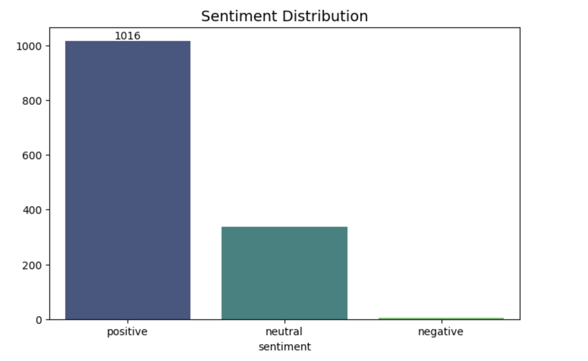
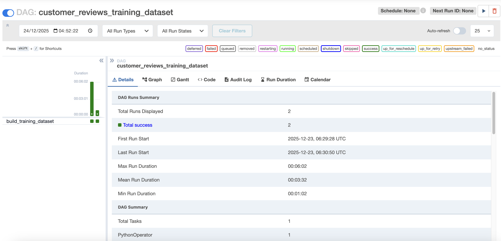

#  Amazon Customer Reviews Data Cleaning

This document describes the **data cleaning, validation, and quality checks** applied to the **Amazon Customer Reviews dataset** before it is used for downstream **machine learning sentiment analysis**.

The objective of this pipeline is to:

- Standardize and normalize text fields
- Remove noise and low-quality records
- Derive sentiment labels
- Produce a **reliable, reproducible training dataset**
- Ensure data quality through validation checks and logging

The final output is a cleaned, deduplicated, English-only, sentiment-labeled dataset suitable for
Sentiment classification

---

## Table of Contents

1. [Data Ingestion](#1-data-ingestion)
2. [Pre-Cleaning Data Quality Assessment](#2-pre-cleaning-data-quality-assessment)
3. [Data Cleaning & Transformation Steps](#3-data-cleaning--transformation-steps)
   - [3.1 Language Filtering (English-only Training)](#31-language-filtering-english-only-training)
   - [3.2 Link Detection & Removal](#32-link-detection--removal)
   - [3.3 Text Standardization](#33-text-standardization)
   - [3.4 Deduplication](#34-deduplication)
4. [Sentiment Annotation](#4-sentiment-annotation)
   - [4.1 Rating Normalization](#41-rating-normalization)
   - [4.2 Sentiment Mapping Rules](#42-sentiment-mapping-rules)
   - [4.3 Unknown Handling](#43-unknown-handling)
5. [Data Quality Logging & Observability](#5-data-quality-logging--observability)
   - [5.1 Logged Data Quality Signals](#51-logged-data-quality-signals)
     - [5.1.1 Null Value Analysis](#511-null-value-analysis)
     - [5.1.2 Duplicate Detection](#512-duplicate-detection)
     - [5.1.3 Label Distribution Monitoring](#513-label-distribution-monitoring)
   - [5.3 Logging vs Enforcement](#53-logging-vs-enforcement)
   - [5.4 Summary](#54-summary)
6. [Running the Pipeline](#6-running-the-pipeline)


## 1. Data Ingestion

- Raw data is ingested from a CSV source.
- The dataset contains:
  - **Structured fields**: `product_id`, `user_id`, `rating`
  - **Unstructured text fields**: `review content`, `review title`, `product description`
- All rows are preserved at ingestion time to avoid premature data loss.

---

## 2. Pre-Cleaning Data Quality Assessment

Before applying transformations, an **initial profiling step** was performed to understand data quality risks in the raw dataset.

### Identified Issues & Impact

| Issue | Description | Impact | Action |
|-----|-----------|--------|--------|
| Duplicate reviews | Same `product_id`, `user_id`, `review_id`, or near-identical text (including spam-like link variations) | Skews sentiment distribution and model learning | Remove duplicates post-normalization |
| Mixed-language text | Reviews may contain non-English or mixed-language segments (Hindi, emojis, symbols, etc.) | Adds noise to NLP models | Filter non-English segments |
| Null values | Only 2 records contain nulls in `rating_count` | Minimal impact; column unused downstream | Records retained |
| Invalid ratings | Non-numeric values (e.g. `|`) present in `rating` | Breaks sentiment derivation | Remove invalid rows |

---
## 3. Data Cleaning & Transformation Steps

### 3.1 Language Filtering (English-only Training)

- Reviews may contain **mixed-language content within a single field**
- Only **English text is retained**
- Non-English segments are removed rather than discarding entire reviews

---

### 3.2 Link Detection & Removal

- Review text is scanned for:
  - URLs
  - Embedded product links
- All detected links are removed to reduce spam and bias

---

### 3.3 Text Standardization

The following columns are standardized:

- `review_content`
- `review_title`
- `about_product`

**Applied transformations:**

- Cast values to string
- Convert text to lowercase
- Remove HTML tags
- Remove URLs and links
- Remove special characters and punctuation
- Normalize whitespace
- Trim leading and trailing spaces

---

### 3.4 Deduplication

After text normalization, duplicate reviews are removed using the combination of:

- `product_id`
- `user_id`
- Cleaned `review_content`

This ensures duplicates are detected based on **semantic content**, not raw text noise.

---


## 4. Sentiment Annotation

The dataset does not contain an explicit sentiment label. Sentiment is therefore **derived from the numeric rating** using a rule-based approach.

### 4.1 Rating Normalization

- `rating` is coerced to a numeric type
- Invalid or malformed values are converted to `NaN`
- Rows with invalid ratings are excluded from annotation

---

### 4.2 Sentiment Mapping Rules

| Rating Range | Sentiment |
|------------|----------|
| 1.0 ≤ rating < 3.0 | negative |
| 3.0 ≤ rating < 4.0 | neutral |
| 4.0 ≤ rating ≤ 5.0 | positive |

---


### 4.3 Unknown Handling

- Ratings outside the expected range
- Missing or null values

➡ Result in `NULL / None` sentiment labels rather than hard failures.

---
### 4.4 Final output



## 5. Data Quality Logging & Observability

Rather than failing the pipeline on all data quality issues, this pipeline follows an **observability-first approach** by **logging key data quality signals** and monitoring them over time.

This design:
- Supports Airflow-friendly monitoring
- Enables auditing and run-to-run comparison
- Avoids unnecessary pipeline failures during exploration and model iteration

Hard failures are reserved only for issues that **block correctness**.

---

### 5.1 Logged Data Quality Signals

The following data quality dimensions are logged on every pipeline run.

---

#### 5.1.1 Null Value Analysis

**Metrics Logged**
- Column-level null percentages
- Row-level null ratios

**Purpose**
- Detect schema drift
- Identify partially ingested or corrupted rows
- Guard deduplication and downstream modeling logic

**Example Signals**
- Columns exceeding configured null thresholds
- Percentage of rows containing at least one null value

> Null checks are enforced only when they impact correctness (e.g. deduplication safety). Otherwise, they are logged for observability.

---

#### 5.1.2 Duplicate Detection

**Metrics Logged**
- Total record count
- Duplicate record count
- Duplicate ratio (%)

**Detection Keys**
- Configurable business keys (e.g. `product_id`, `user_id`, `review_content_clean`)

**Purpose**
- Identify copy-paste or spam reviews
- Detect ingestion retries or upstream duplication
- Quantify data inflation risk

Deduplication is applied **only after validating row-level null ratios** to prevent accidental data loss.

---

#### 5.1.3 Label Distribution Monitoring

**Metrics Logged**
- Sentiment label counts and percentages:
  - `negative`
  - `neutral`
  - `positive`

**Purpose**
- Detect class imbalance
- Monitor label drift across ingestion dates
- Support downstream model stability checks

Label distributions are logged and compared across runs. No hard failures are triggered.

---

### 5.2 Logging vs Enforcement

During early development and exploration phases:

- No historical baseline exists
- Data quality patterns are still being learned
- Hard enforcement would block iteration

As baselines stabilize, selected checks can be **promoted from logging → enforcement**.

---

### 5.4 Summary

This pipeline treats data quality as a **continuous signal**, not a one-time gate:

- Measure first
- Observe trends
- Enforce later

This approach enables safer scaling, improved model performance, and production-ready data governance.

----

## 6. Running the Pipeline

The entire environment is **containerized with Docker**. No local dependency installation is required.


### Prerequisites
- Docker
- Docker Compose
- Make

### Commands

```bash
# Initialize Airflow database and admin user
make init

# Start Airflow services
make up

# Stop services
make down

# View logs
make logs

# Bash into the Airflow webserver
make bash

# Launch Jupyter Lab
make jupyter
```
Once the services are running, access the Airflow UI at:
```
http://localhost:8080

```
From the UI you can:
- Trigger DAG runs
- Inspect task logs
- View retries and failures
- Monitor historical runs

